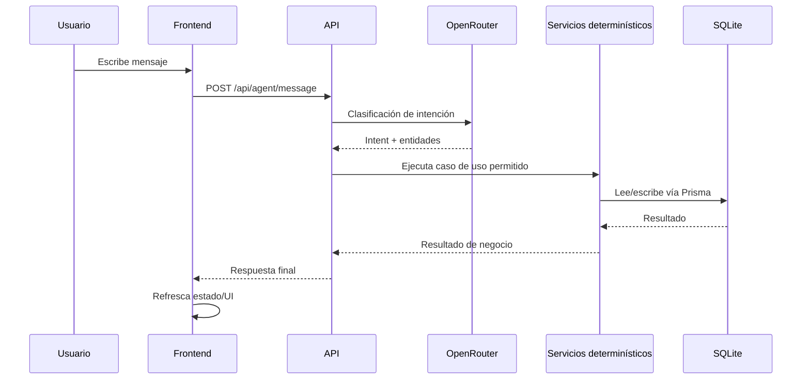

# Flujo del agente de IA

## Qué hace

El endpoint `POST /api/agent/message` permite que un colaborador escriba en lenguaje natural y reciba una respuesta accionable del sistema.

## Flujo de ejecución

## Principios de seguridad y control

1. `OPENROUTER_API_KEY` solo existe en backend.
2. El frontend nunca llama OpenRouter directamente.
3. El LLM interpreta intención, pero la decisión final la toma el backend.
4. Cualquier cambio de datos pasa por validaciones determinísticas.

## Rol y límites del LLM

- El LLM **clasifica intención** y extrae entidades del mensaje del usuario.
- El LLM **no ejecuta SQL ni Prisma** y no decide políticas críticas.
- Si hay ambigüedad, el backend responde pidiendo aclaración antes de accionar.

## Cómo se ejecutan acciones reales

1. El controlador recibe `POST /api/agent/message`.
2. El servicio de agente consulta OpenRouter para interpretar el mensaje.
3. Con la intención detectada, el backend invoca servicios de dominio (cursos, inscripciones, recomendaciones).
4. Esos servicios validan reglas y recién después persisten con Prisma/SQLite.

## Uso de tokens y formato de respuestas

- Los tokens del proveedor IA se consumen solo en backend.
- Las respuestas críticas al usuario (errores de política, estados y acciones ejecutadas) se formatean en backend para mantener consistencia y auditabilidad.

## Flujo resumido para defensa

1. Frontend llama al backend (`POST /api/agent/message`).
2. Backend usa OpenRouter para interpretar intención.
3. El LLM propone intent + entidades; no ejecuta reglas críticas.
4. Servicios determinísticos aplican políticas y ejecutan la acción.
5. Prisma accede a SQLite para lectura/escritura.
6. Backend responde y el frontend refresca la UI.

## Intenciones soportadas

- Listar cursos
- Ver inscripciones activas
- Ver historial completado
- Pedir recomendaciones
- Inscribir en curso
- Cancelar inscripción
- Completar inscripción
- `unknown` (pedir aclaración)

## Qué defender ante jurado

- IA para comprensión de lenguaje natural.
- Reglas críticas controladas por código determinístico.
- Integridad de datos protegida por servicios + políticas de negocio.
