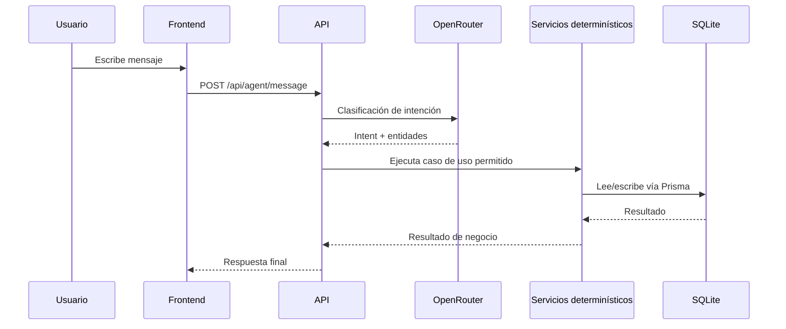

# Flujo del agente de IA

## Qué hace

El endpoint `POST /api/agent/message` permite que un colaborador escriba en lenguaje natural y reciba una respuesta accionable del sistema.

## Flujo de ejecución

## Principios de seguridad y control

1. `OPENROUTER_API_KEY` solo existe en backend.
2. El frontend nunca llama OpenRouter directamente.
3. El LLM interpreta intención, pero la decisión final la toma el backend.
4. Cualquier cambio de datos pasa por validaciones determinísticas.

## Intenciones soportadas

- Listar cursos
- Ver inscripciones activas
- Ver historial completado
- Pedir recomendaciones
- Inscribir en curso
- Cancelar inscripción
- Completar inscripción
- `unknown` (pedir aclaración)

## Qué defender ante jurado

- IA para comprensión de lenguaje natural.
- Reglas críticas controladas por código determinístico.
- Integridad de datos protegida por servicios + políticas de negocio.
