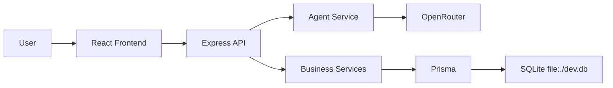

# Architecture

## Overview

The project is organized as a monorepo with separate applications for the web client and the API, plus a shared package for common contracts.

## Mermaid diagram

## Notes

- The Agent Service and OpenRouter integration are intentionally deferred.
- Business validations remain deterministic in the backend.
- SQLite is used for local development and demos. The Prisma schema is portable to PostgreSQL if needed for production.
