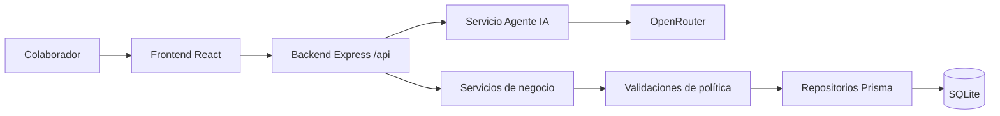

# Arquitectura general

## Vista rápida

Hackathon Compucad está organizado como monorepo con dos aplicaciones:

- `apps/web`: interfaz React para colaboradores.
- `apps/api`: API Express con lógica de negocio, políticas y conexión a OpenRouter.

La fuente de verdad de datos es SQLite vía Prisma.

## Flujo defendible ante evaluación

## Capas de aplicación

| Capa | Responsabilidad |
|---|---|
| Controller | Recibir request HTTP y devolver response |
| Service | Orquestar casos de uso y reglas de negocio |
| Repository | Acceso a datos con Prisma |
| Database | Persistencia en SQLite |

## Principios operativos

1. El frontend no accede a base de datos ni a OpenRouter directamente.
2. `OPENROUTER_API_KEY` vive solo en backend (`apps/api/.env`).
3. El LLM clasifica intención; no ejecuta operaciones críticas por sí mismo.
4. Inscripciones/cancelaciones/finalizaciones se resuelven por servicios determinísticos.

## Módulos backend

- `health`
- `courses`
- `collaborators`
- `enrollments`
- `recommendations`
- `agent`
